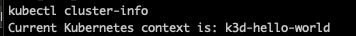
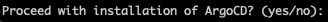
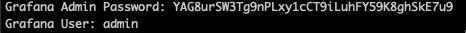
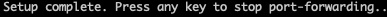

# ⛵ Introduction

This repository hosts a script designed to streamline the setup and configuration process for a Kubernetes cluster using k3d. The script automates the deployment of a k3d cluster and configures it for seamless integration with ArgoCD. Additionally, it orchestrates the installation of Grafana, Prometheus and an Ethereum node running Geth as the execution client and Prysm for the consensus client.

## Table of contents[](#table-of-contents)

- [Features](#features)
- [Motivation](#motivation)
- [Machine Preparation](#machine-preparation)
- [Infrastructure and Ethereum node setup](#infrastructure-and-ethereum-node-setup)
  - [Quick start](#quick-start)
    - [Prompts and expected outputs](prompts-and-expected-outputs)
    - [Additional commands](#additional-commands)
- [Connected peer monitoring](#connected-peer-monitoring)
  - [Setup Commands](#setup-commands)
  - [Start peer monitor](#start-peer-monitor)
- [Cleanup](#cleanup)
- [Script Description](#script-description)
  - [Script Overview](#script-overview)

## Features[](#features)

- Automated setup and configuration of a k3d Kubernetes cluster
- Integration with ArgoCD for GitOps-style continuous delivery
- Deployment of ethereum mainnet node using Geth and Prysm
- Deployment of monitoring stack using Prometheus and Grafana

## Motivation[](#motivation)

This repository is designed to streamline the process of deploying a Kubernetes cluster using k3d, seamlessly installing and configuring essential tools like ArgoCD, Prometheus, and Grafana. This setup not only facilitates running an Ethereum node but also includes all necessary dashboards for comprehensive monitoring.

## Machine Preparation[](#machine-preparation)

| Software | Description                                                                                                   | Install link                                                |
| :------- | :------------------------------------------------------------------------------------------------------------ | :---------------------------------------------------------- |
| k3d      | k3d is a lightweight wrapper to run k3s (Rancher Lab's minimal Kubernetes distribution) in docker             | [Here](https://k3d.io/v5.6.0/#installation)                 |
| Helm     | Helm helps you manage Kubernetes applications.                                                                | [Here](https://helm.sh/docs/intro/quickstart/#install-helm) |
| Kubectl  | Kubectl is the command line configuration tool for Kubernetes that communicates with a Kubernetes API server. | [Here](https://kubernetes.io/docs/tasks/tools/)             |
| Docker   | Docker is a software platform that allows you to build, test, and deploy applications quickly.                | [Here](https://docs.docker.com/engine/install/)             |

## Infrastructure and Ethereum node setup[](#infrastructure-and-ethereum-node-setup)

### Quick start[](#quick-start)

```zsh
make
```

#### Prompts and expected outputs[](#prompts-and-expected-outputs)

This section details the prompts and outputs that the script will generate, presented in the sequence in which they are expected to appear.

| Output/Prompt                                           | Image                            | Expected result                                                                                                                                                                                                    |
| :------------------------------------------------------ | :------------------------------- | :----------------------------------------------------------------------------------------------------------------------------------------------------------------------------------------------------------------- |
| Output 1: Kube context                                  |  | The script should display the current kubernetes context as `k3d-hello-world`                                                                                                                                      |
| Prompt 1: Proceed with installation of ArgoCD? (yes/no) |  | Assuming the kube context is set to `k3d-hello-world` you should proceed with the installation of Argo.                                                                                                            |
| Output 2: Grafana credentials                           |  | The script will install Argo, once the installation and sync is complete the script will check to see if Grafana is running. The script will open your default browser and direct you to the Grafana landing page. |
| Output 3: Press any key to stop port-forwarding         |  | The script will setup a port-forward to Grafana, once you're complete press any key in the terminal you've ran the script and it'll stop the port-forward and it'll exit                                           |

#### Additional commands[](#additional-commands)

| Command                                                                                                     | Description                                      |
| ----------------------------------------------------------------------------------------------------------- | ------------------------------------------------ |
| `kubectl get secret grafana --namespace grafana --output=jsonpath="{.data.admin-password}" base64 --decode` | Retrieves and decodes the Grafana admin password |
| `kubectl port-forward --pod-running-timeout=1m0s svc/grafana 3000:80 --namespace grafana`                   | Port-forwards to the Grafana service             |

## Connected peer monitoring[](#connected-peer-monitoring)

### Configuration[](#configuration)

The configuration file used by the peer monitoring app can be found [here](./config/config.yaml) you should update the url if you're unable to port-forward to port 8545.

```yml
# Configuration for JSON-RPC HTTP POST Request Sender
url: "http://127.0.0.1:8545/"
intervalSeconds: 10
```

This configuration file is used by the [Go application](main.go) to set up parameters for sending HTTP POST requests to a JSON-RPC server. The configuration file must be in YAML format and include the following parameters:

| Parameters              | Description                                                                | Example                                                                                          | **Required** |
| :---------------------- | :------------------------------------------------------------------------- | :----------------------------------------------------------------------------------------------- | :----------- |
| `url (string)`          | The URL of the JSON-RPC server where the HTTP POST requests will be sent.  | '"http://127.0.0.1:8545/"' indicates that the server is hosted locally and listens on port 8545. | Yes          |
| `intervalSeconds (int)` | The interval in seconds at which the POST requests are sent to the server. | `10` means that the requests will be sent every 10 seconds.                                      | Yes          |

### Setup Commands[](#setup-commands)

| Command                                                                                       | Description                                                                                                                                                          |
| --------------------------------------------------------------------------------------------- | -------------------------------------------------------------------------------------------------------------------------------------------------------------------- |
| `kubectl port-forward --pod-running-timeout=1m0s svc/ethereum 8545:8545 --namespace ethereum` | Used to temporarily connect your local machine directly to ethereum service running in a Kubernetes cluster. Specifically the rpc port running on the Geth container |

### Start peer monitor[](#start-peer-monitor)

Please open a new terminal session and execute the command below.

> Note that the app will fail to connect to the Ethereum node if the port-forwarding initiated by the previous command was unsuccessful or is not currently active.

```zsh
go run main.go
```

## Cleanup[](#cleanup)

```zsh
k3d cluster delete hello-world
```

## Script Description[](#script-description)

This [Bash script](./scripts/setup.sh) is designed for managing a Kubernetes development environment using k3d (a lightweight wrapper for running k3s in Docker). It includes various functions to ensure prerequisites are met, set up a Kubernetes cluster, and manage deployments like ArgoCD and Grafana. Here's a breakdown of its primary functionalities and components.

### Script Overview[](#script-overview)

#### Environment Configuration

- Sets the script to treat unset variables as an error, which enhances robustness by avoiding potential misbehavior due to uninitialized variables.
  Configures an environment variable K3D_FIX_DNS=1 to address a specific DNS issue related to k3d, ensuring DNS resolution works correctly within the created clusters.
  Utility Functions:

- yes_no: Prompts the user for a yes/no response to control script execution flow based on user input.
  requirement_check: Verifies if essential tools like Docker, k3d, Helm, and kubectl are installed. The script exits if any of these tools are missing, ensuring all necessary dependencies are present before proceeding.

#### Cluster Management

- cluster_setup: Creates a k3d cluster named "hello-world" if it doesn't already exist. Checks for an existing cluster and configuration file, then proceeds to create the cluster. Ensures the Kubernetes context is set correctly and prompts the user to proceed with installing ArgoCD.
  Application Deployment:

- install_argo: Manages the deployment of ArgoCD using Helm, including updating dependencies and applying Kubernetes manifests. Sets up ArgoCD in its own namespace, essential for managing applications within Kubernetes.
  grafana: Sets up port forwarding to a Grafana service, retrieves the admin password from a Kubernetes secret, and attempts to open the Grafana dashboard in a web browser. Adapts to the operating system to use the appropriate command to open the browser.

#### Main Execution Flow

- main: Orchestrates the script's execution starting with the requirement check followed by the cluster setup.
  Key Features:

- Robust Error Handling: The script checks the availability of necessary tools and the status of operations, exiting with an informative error message if something goes wrong.
  User Interaction: Through the yes_no function, it involves the user in decision-making processes, making the script interactive.
  Multi-OS Support: Handles different commands for macOS and Linux for opening URLs, enhancing the script’s portability across different development environments.
  Security and Accessibility: Handles sensitive data securely by fetching secrets only when needed and ensures accessibility by automating port forwarding and browser operations.
